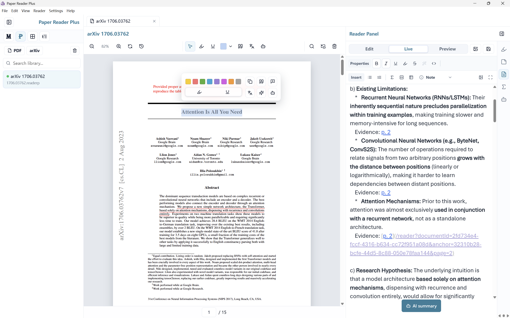
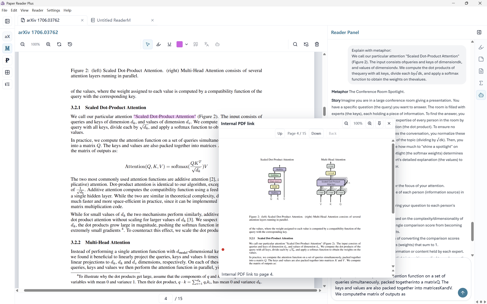
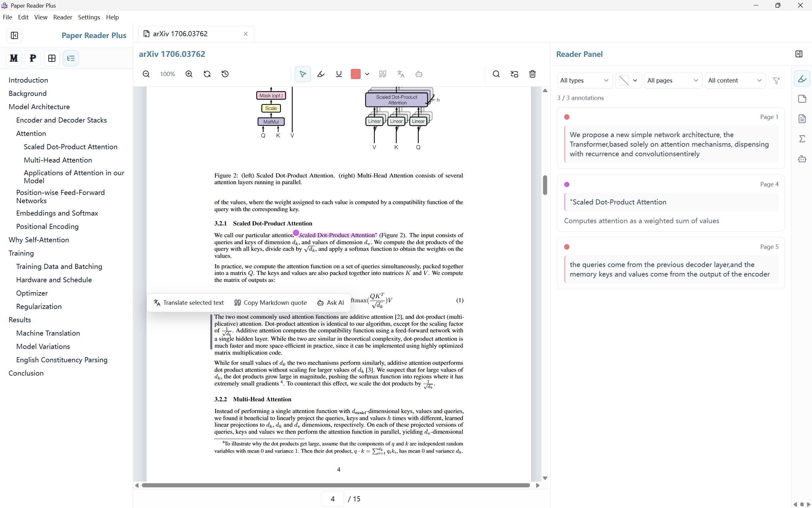
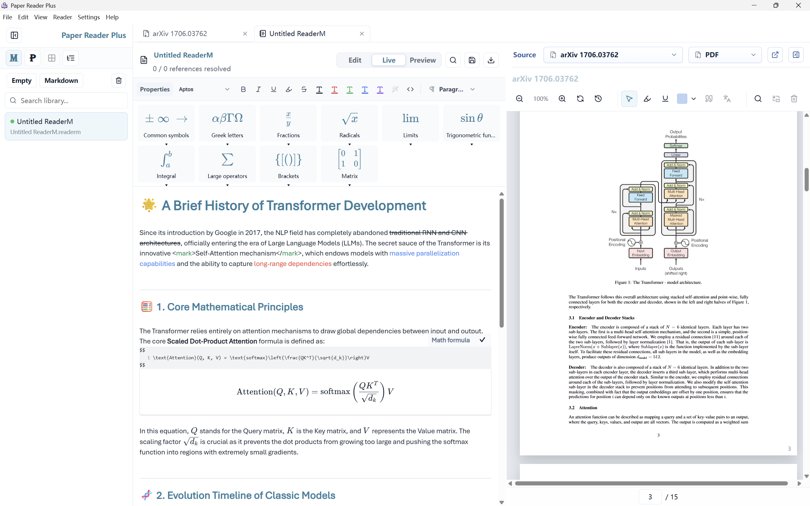
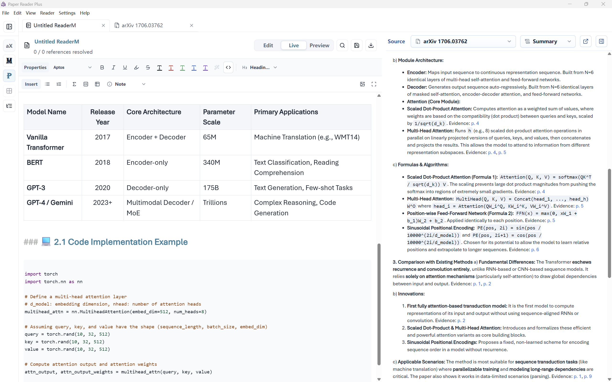

# Paper Reader Plus

[简体中文](README-cn.md) | English

Paper Reader Plus is a desktop workspace for reading, annotating, translating, and writing around academic papers. It combines a PDF reader, Markdown editor, evidence-linked notes, AI assistance, translation tools, and portable ReaderP/ReaderM packages in one local Electron app.


## Version

Current app version: `0.2.2`

Package manifest versions: ReaderP `1`, ReaderM `1`


## Overview

### ReaderP Reading Workspace

ReaderP keeps the PDF, library history, annotation tools, and evidence-linked Markdown notes in one workspace.




Selection actions can send paper context to AI, translate or explain selected text, and keep answers linked back to exact PDF locations.




The reader outline, floating selection actions, and annotation list make it easier to review evidence and return to important passages.





### ReaderM Writing Workspace

ReaderM provides a Markdown-centered writing mode with live rendering, formula helpers, and a side-by-side source pane.




ReaderM documents can combine rendered tables, highlighted code, rich Markdown content, and source navigation across PDF, notes, and summaries.




## Features

- Local paper library: import `.pdf`, `.md`, `.readerp`, and `.readerm` files into a local Electron `userData` workspace.
- PDF reading: scroll through papers, zoom, jump to pages, search loaded pages, view thumbnails and outlines, follow internal PDF links, and navigate back to previous positions.
- Evidence anchors: create stable links from notes and AI output back to exact PDF locations with `/reader?documentId=...&anchor=...` links.
- Annotations: highlight, underline, add notes, quote selected text into Markdown, ask AI about a selection, or translate selected text.
- Paragraph actions: detect visible PDF text blocks and run actions such as quote, translate, or ask AI on paragraph-level content.
- Markdown writing: write notes and ReaderM documents with CodeMirror-powered Markdown editing, KaTeX math, Mermaid diagrams, callouts, task lists, tables, sanitized HTML blocks, code blocks with optional line numbers, syntax highlighting, safe links, local image assets, image size hints, captions, and reader anchor links.
- ReaderP packages: save PDF-centered reading sessions, notes, summaries, AI history, anchors, annotations, symbols, and referenced assets into portable `.readerp` files.
- ReaderM packages: save Markdown-centered writing projects with linked paper references, anchors, annotations, symbols, assets, and edit/preview split workflows into portable `.readerm` files.
- AI reading assistant: use an OpenAI-compatible chat completion API for paper Q&A, selection explanations, summaries, translations, metaphor explanations, and evidence-linked answers.
- Translation modes: translate with the AI provider or dedicated Google Cloud Translation / Baidu General Translation integrations.
- Formula OCR: recognize selected PDF formula regions through SimpleTex OCR when configured.
- Quote templates: customize copied quotes, note markers, and ReaderM source links with simple template variables such as `paragraph_content`, `page_marker`, `passage_name`, `page_number`, `page_label`, and `href`.
- Network proxy: route arXiv downloads, source imports, and Google Cloud Translation through the configured HTTP proxy when enabled.
- arXiv support: import arXiv PDFs and bind LaTeX source files when available.
- Symbol tracking: extract and manage paper symbols or abbreviations from PDF and LaTeX context.
- Figure and table assistance: preview figures and tables, inspect extracted table content, and open spreadsheet-style table views.
- Local dictionary: save definitions and link terms back to source documents or anchors.
- Author network preview: inspect local author relationships from the imported library metadata.
- Bilingual UI: renderer text, Electron menus, and common dialogs support system language, English, and Simplified Chinese.


## API Configuration

Open `Help > API Guide` in the app for step-by-step setup instructions. The guide is also stored at `docs/api.md`.

The app supports:

- Agent API: OpenAI-compatible Chat Completions endpoints for AI reading, selection Q&A, summaries, AI translation, and metaphor explanations.
- Translation API: Google Cloud Translation or Baidu General Translation when `Translation Mode` is set to API mode.
- OCR API: SimpleTex LaTeX OCR Turbo for formula recognition from selected PDF regions.

Configuration is stored locally in the app settings. Do not commit real API keys; `docs/key.example.json` is only a development template, and `docs/key.local.json` should remain local.


## Data Storage

Runtime data is stored in Electron's `app.getPath("userData")` directory. On Windows this is typically:

```text
C:\Users\<user>\AppData\Roaming\Paper Reader Plus
```

This directory contains:

```text
paper-reader-plus.json      # library records, notes, summaries, settings, AI history, anchors, annotations
library\                    # imported document copies
library-assets\             # local Markdown image assets
```

Installing or updating the app does not automatically remove this data. To reset the app manually, close Paper Reader Plus and delete the user data directory.

Built-in prompt templates and help files live in `docs/`, including `help.md`, `api.md`, and `*.j2` prompt templates. During packaging, the `docs` directory is copied into the app resources so templates, API guidance, and examples are available in installed builds.


## Markdown Reference

Paper Reader Plus uses source-first Markdown. The editor keeps the raw Markdown text as the source of truth while live mode and preview mode render common structures.

Supported additions include:

- Inline math with `$...$` and block math with `$$` fences through KaTeX.
- Mermaid diagrams with fenced code blocks using `mermaid`.
- GitHub-style callouts such as `> [!NOTE]`, `> [!TIP]`, `> [!IMPORTANT]`, `> [!WARNING]`, and `> [!CAUTION]`.
- Task list items with `- [ ]` and `- [x]`.
- Highlight syntax with `==highlighted text==` when Markdown highlight rendering is enabled.
- Local and remote image links, image captions from Markdown titles, and size hints such as ``.
- Sanitized HTML blocks for details, images, tables, media, and simple layout markup when live HTML rendering is enabled.
- Reader links such as `/reader?documentId=...&anchor=...`, `readerp://...`, and `readerm://...`.


## Development

Install dependencies:

```bash
npm install
```

Run the app in development mode:

```bash
npm run dev
```

Build the renderer and Electron main process:

```bash
npm run build
```

Run tests:

```bash
npm run test
```

Start from existing build output:

```bash
npm start
```


## Packaging

Create an unpacked Windows app directory:

```bash
npm run package
```

Create a Windows installer:

```bash
npm run dist
```

Build outputs are written to:

```text
release/
```


## License

Paper Reader Plus is licensed under the PolyForm Noncommercial License 1.0.0.
You may use, copy, modify, and distribute it for noncommercial purposes only.
Commercial use requires separate permission.


## Project Structure

```text
paper-reader-plus/
  electron/                  Electron main process, preload, IPC, packaging services
  electron/ipc/              Document, library, asset, annotation, settings, and ReaderM IPC
  electron/services/         AI, translation, arXiv, help, docs config, health, and maintenance services
  src/                       Vue renderer application
  src/components/            PDF reader, sidebars, panels, editor, modals, and previews
  src/composables/           Document lifecycle, PDF, AI, translation, annotation, and preview logic
  src/pdf/                   PDF viewport, coordinates, references, text, and rendering utilities
  src/services/              Renderer-side domain logic for anchors, annotations, Markdown, AI, dictionary, symbols, tables
  src/vendor/                Vendored editor integrations used by the renderer
  src/styles/                Domain-specific CSS modules
  tests/                     Vitest coverage for services, IPC contracts, PDF logic, packages, and migrations
  docs/                      Help content, API guide, prompt templates, and example key configuration
  icon/                      Application icons
  dist/                      Vite build output
  dist-electron/             Electron TypeScript build output
  release/                   electron-builder output
```


## Notes for Contributors

- Renderer code calls local capabilities through `window.paperReaderPlus`; it should not directly read or write local filesystem paths.
- IPC channel names follow a `domain:action` convention.
- Persistent schema changes should update shared types, preload typings, IPC handlers, store migration, and tests together.
- Keep PDF coordinate, text-layer, anchor, and annotation logic in dedicated services or `src/pdf/` utilities instead of duplicating conversions inside Vue components.
- Keep styling in the relevant `src/styles/` file, with global tokens and base styles in `src/style.css`.
